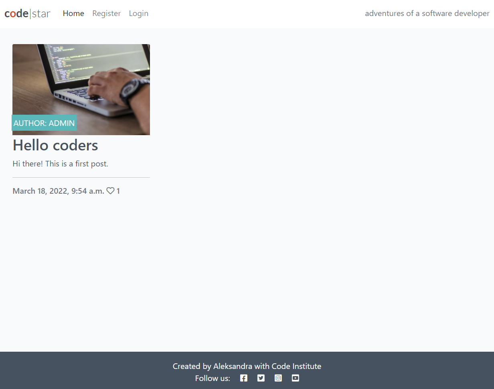

# Django Blog 

A project created using the Django Framework as part of the Diploma in Full Stack Software Development with Code Institute. 

Among the things I learnt with this projects are:
- how to create the view code
- how to create a template to render the view
- how to connect up my URLs in the urls.py file
- deploment steps
    - create the Heroku app
    - attach the PostgreSQL database
    - prepare environment and settings.py files
    - get the static and media files stored on Cloudinary

[Link to deployed project](https://ah-codestar2022.herokuapp.com/)

